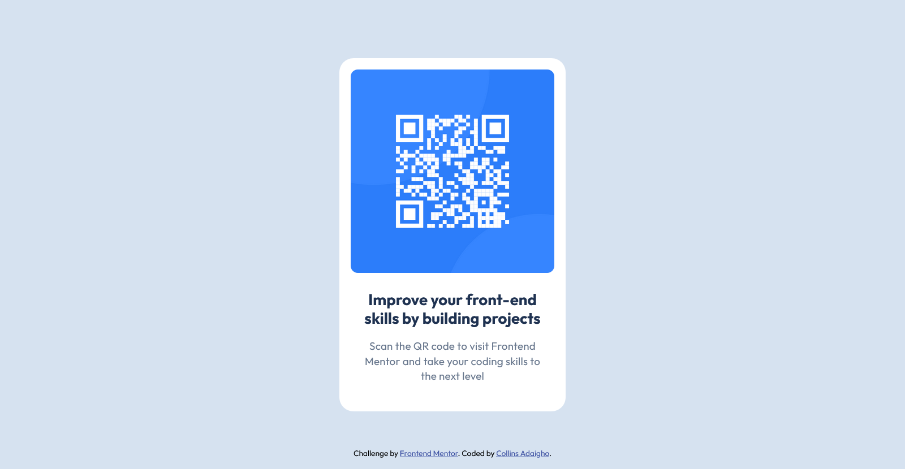

# Frontend Mentor - QR code component solution

This is a solution to the [QR code component challenge on Frontend Mentor](https://www.frontendmentor.io/challenges/qr-code-component-iux_sIO_H). Frontend Mentor challenges help you improve your coding skills by building realistic projects. 

## Table of contents

- [Frontend Mentor - QR code component solution](#frontend-mentor---qr-code-component-solution)
  - [Table of contents](#table-of-contents)
  - [Overview](#overview)
    - [Screenshot](#screenshot)
    - [Links](#links)
  - [My process](#my-process)
    - [Built with](#built-with)
    - [What I learned](#what-i-learned)
    - [Continued development](#continued-development)
  - [Author](#author)

## Overview

### Screenshot



### Links

- Solution URL: [Repository URL](https://github.com/Donsmatt/fm_qr_card_component)
- Live Site URL: [QR card component live site](https://fm-qr-card-component.vercel.app/)

## My process

### Built with

- Semantic HTML5 markup
- CSS custom properties
- CSS Variables
- Flexbox
- CSS Grid

### What I learned

This was a relatively good start to my frontend mentor challange path. I was very glad with the figma files i could work with to get a pixel match of the design. I hope i can afford the pro version sometime in the future for an easier coding experience.
```css
:root {
  --fz-md: 15px;
  --fz-lg: 22px;
  --ff: "Outfit", serif;
  --fw: 400;
  --fwb: 700;

  --primary: hsl(0, 0%, 100%);
  --secondary-300: hsl(212, 45%, 89%);
  --secondary-500: hsl(216, 15%, 48%);
  --secondary-900: hsl(218, 44%, 22%);
  --accent-link: hsl(228, 45%, 44%);

  --border-radius-sm: 10px;
  --border-radius-md: 1.25rem;
  --container-width: 320px;
  --padding-sm: 1rem;
  --gap-md: 1.5rem;
}
```

### Continued development

I would want to improve on my css code optimixation and naming conventions.

## Author

- Frontend Mentor - [@Donsmatt](https://www.frontendmentor.io/profile/Donsmatt)
- Twitter - [@Donsmatt](https://x.com/CAdaigho)
- Github = [@Donsmatt](https://github.com/Donsmatt)
